# 3D Game Engine Development – ICA 25/26

BY Gabrielius Mizutavicius - D00265365

---

## Screencast

**Screencast Link:** https://

## Narrative Summary

"DEAR SOBER me" is a short, single room investigative game as required by the brief.

The player wakes up after a blackout in an unfamiliar room with no memory on how they ended up there. A note addressed to their sober self apologises for the night and hints at unsettling experience the drunk self had.

You examine objects, collecting scattered belongings and polaroid pictures with some notes on them. The player can reconstruct the events of the night. The more they find the more new interactions are available. To free yourself from the room you have to un-barricade the door and leave behind a reminder about responsible drinking and its consequences.

---

## Object Data Model

Interactive objects are GameObjects and have components attached like the colliders to allow raycasting. Objects don't store any interaction. It is hardcoded within Main using the object's name and the current player state. Progression is controlled by the player state component like ownership and insight but it is checked in main.

---

## Interaction Pipeline

All interactions are based off raycasting to make the 4 verbs work.

### Examine

When hovering over the object, it displays the name and available interactions. On click, the player enters the examination mode where the camera is frozen, object is put in front of the camera, dialogue is shown and "HM" SFX is played.

> Hover

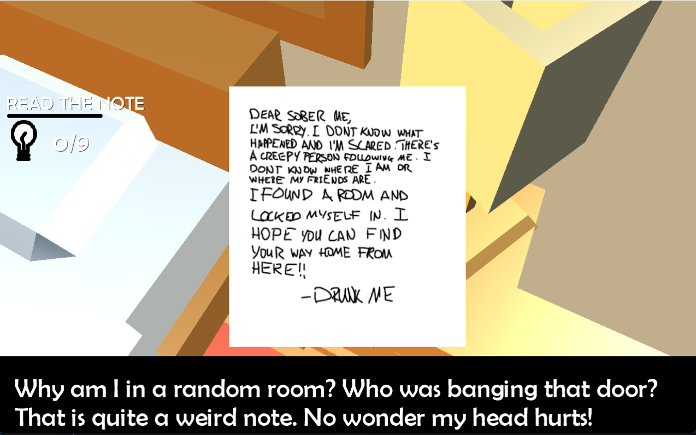

> Click

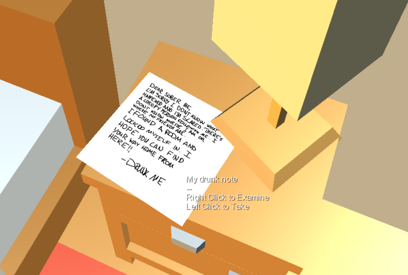

### Collect

On Click, the object is hidden from the player, added to the inventory, SFX is played and player's insight increases.

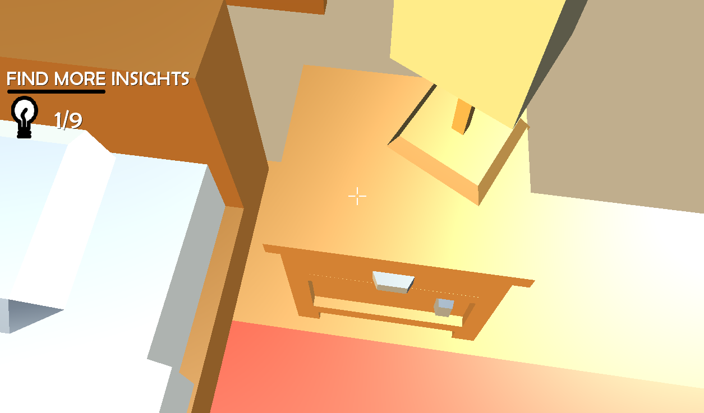

### Activate

Certain objects become available after reaching specific insight level. Activating those objects reveals more objects like tools which allows the player to interact with the door.

> Before Pickup

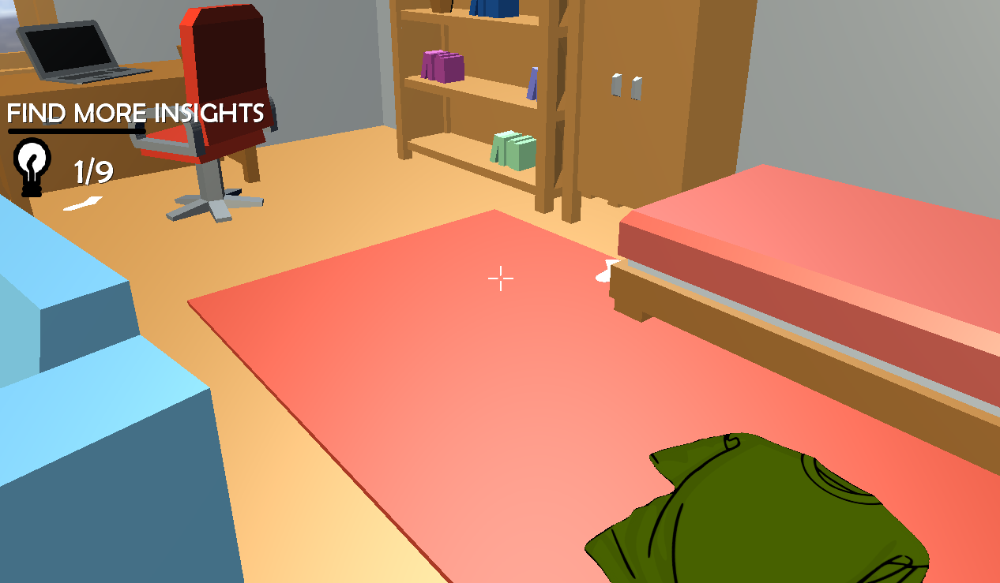

> After Pickup

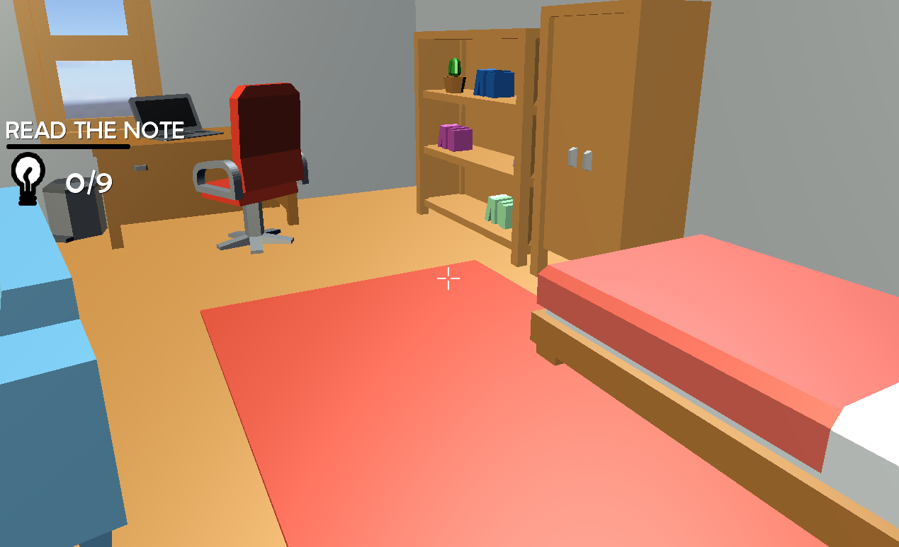

### Use

Collected objects are used for progression. As the player gains more objects and insight, new objects appear which allow further progression and eventually escaping the room.

> When insight level is at 9, tools appear.

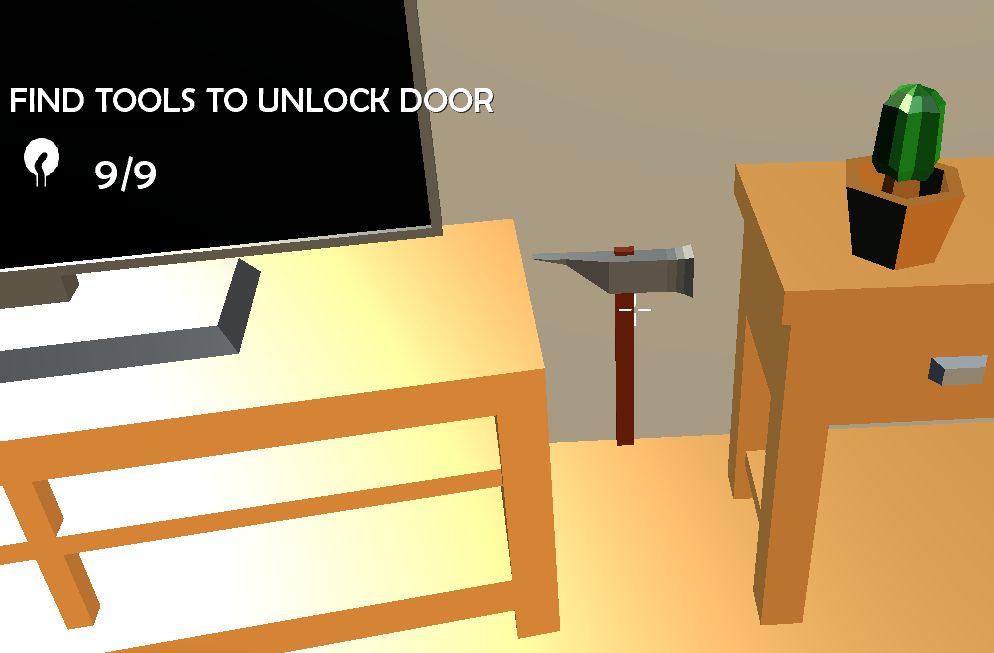

> Picking up the tools lets you unlock the door.

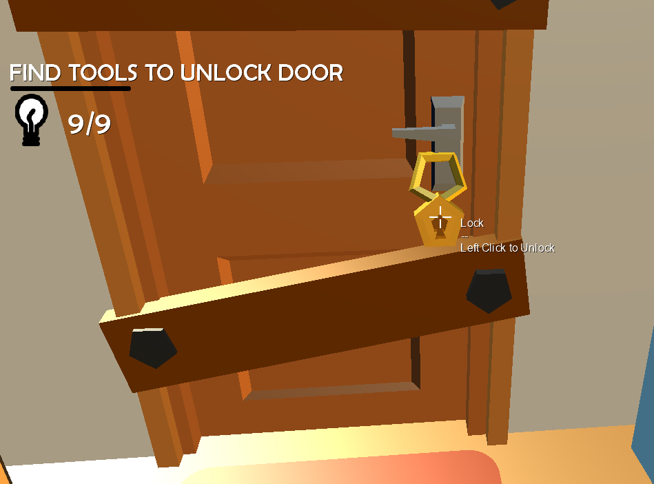

---

## Audio Design

The music has two states:

- Confusion stage where the music emphasis that emotion
- Calm stage where the player finally calmed down and just investigating what happened.

There is many SFX in the game:

- Examine, Collect, Activate, Use
- Self Talk at the beginning to add more personality
- Headache (intense sound just for the person themselves to briefly feel it)
- Door knocking being the starting point

I added two spatial exterior ambiences which can be heard occasionally like the cars beeping and the birds chirping.

---

## Camera Behaviour

There is a standard non colliding camera for the player to explore the map with. I tried physics and unfortunately spent so much time that it was better to go with this.

There is the examination mode where the camera is frozen and item it put closer for the player to see.

There will also be camera curve of the player waking up out of the bed.

---

## Design Pattern

The project follows the same pattern that the original code started with which is a component based design with event driven communication between components.

PlayerState, inventory, audio, camera, spacial audio emitter and others are implemented as components.

Events like audio change/play/stop, add to inventory and UI button clicking are used to communicate between components easier.

---

## Technical Excellence Feature

I decided to work on the Option B - Orchestration Sequence Extension within my game.

They are both used in the introduction and then the outro of the game. Both do sequenced changes to UI, transforms and camera. One plays the self talk and timed steps for the dialogue to appear at the exact time and then to play background music.

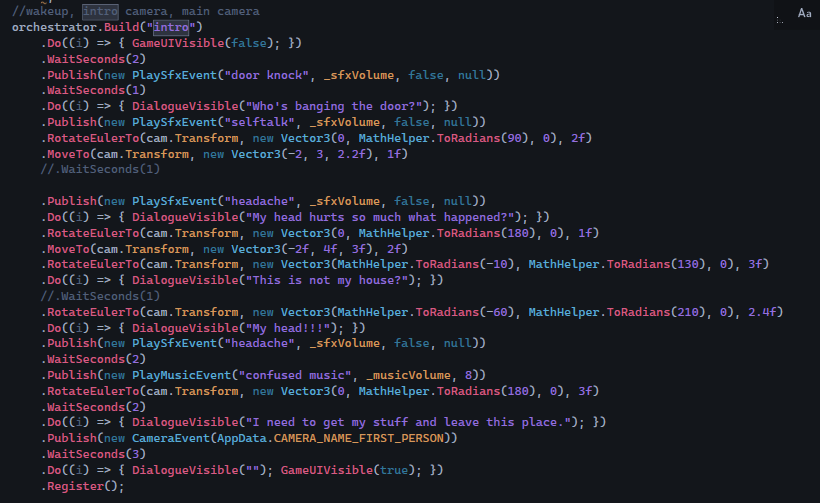

---

## Design Rationale

I decided to use Orchestration Sequence Extension as I wanted to have a cutscene for both the introduction of the game and the outro. This involved camera manipulation (waking up/walking to the door), object transforms (door opening) and dialogues (self-talk caption / outro text) that had to be performed in timed order which I felt using the orchestration would be beneficial for the project.

---

## Build & Run Instructions

Final Build File will be here:

[[Build File]](./Final%20Build/)

---

## References

- All furniture models are from https://kenney.nl/assets/furniture-kit accessed on the 06/01/2026
- Socks from https://patternuniverse.com/download/socks-pattern/ accessed on the 07/01/2026
- shirt from https://www.clker.com/clipart-green-2-t-shirt.html accessed on the 07/01/2026
- pants from https://pngtree.com/freepng/pants-clip-art-jeans-clipart_8974957.html accessed on the 07/01/2026
- crosshair from https://www.flaticon.com/de/kostenloses-icon/prazision_889828 accessed on the 08/01/2026
- door knock sound from https://freesound.org/people/deleted_user_4772965/sounds/256512/ accessed on the 08/01/2026
- hm sound from https://freesound.org/people/trimono/sounds/519112/ accessed on the 08/01/2026
- bird sound from https://freesound.org/people/KikkaKibaz/sounds/686635/ accessed on the 08/01/2026
- headache sound from https://freesound.org/people/13NHarri/sounds/353804/ accessed on the 08/01/2026
- car honk sound from https://freesound.org/people/vialgames/sounds/613142/ accessed on the 08/01/2026
- Collect sound from Niall's included assets which I couldn't find the references to. (Artist: SwishSwoosh)
- plank break sound from https://freesound.org/people/Vinni_R/sounds/630592/ accessed on the 09/01/2026
- key sound from https://freesound.org/people/sijam11/sounds/204860/ accessed on the 09/01/2026
- Left mouse and right mouse click images from https://codingartistweb.com/2022/04/distinguish-between-left-right-middle-mouse-click/ accessed on the 09/01/2026
- WASD image from https://www.istockphoto.com/vector/computer-gamer-keyboard-wasd-keys-vector-illustration-wasd-keys-game-control-gm1193231012-339319726?searchscope=image%2Cfilm accessed on the 09/01/2026
- F5 image from https://www.shutterstock.com/image-vector/f5-key-icon-keyboard-button-symbol-2310442671?trackingId=6978772d-5965-473b-86a5-4695eae009cd&listId=searchResults accessed on the 09/01/2026

## Images

Many were edited by me to cover up faces and style it to my liking.

### Generated using raphael.app

Image 1 : "Generate: a guy with blue jeans and green shirt partying with friends"

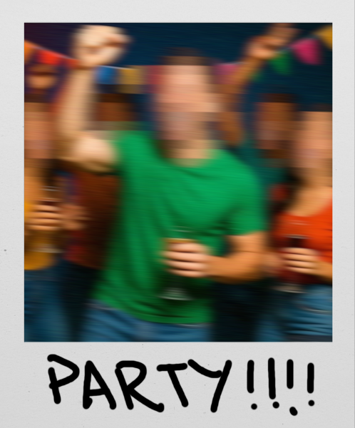

Image 2 : "Generate: blue jeans and green shirt guy getting uncomfortable and a bit drowsy within the party within some in the background lurking in the shadows"

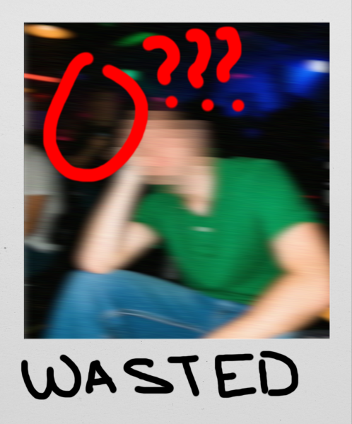

Image 3 : "Generate: blue jeans and green shirt guy walking down the street worried, scared and stumbling while a random person in the shadows follows them at night."

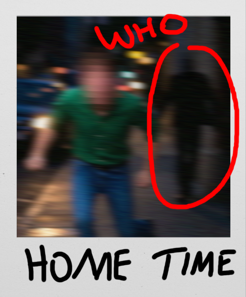

Image 4 : "Generate: taking a blurry picture of a hallway at night white dimmed light seeing a shadow figure in the far distance."

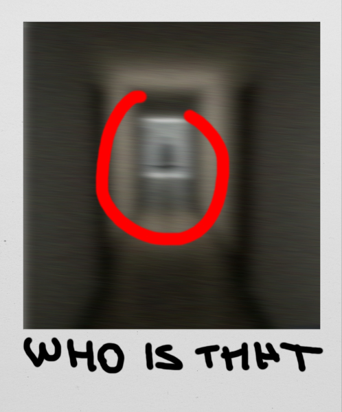

### Generated using craiyon.com

Image 5 : "Make it more realistic like more real life but a bit lack of care in the room as there was partying and just uncleanliness" & attached a screenshot of the room layout

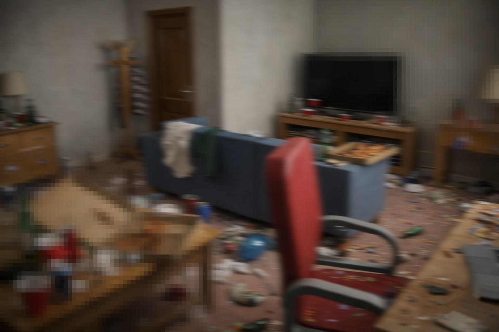
